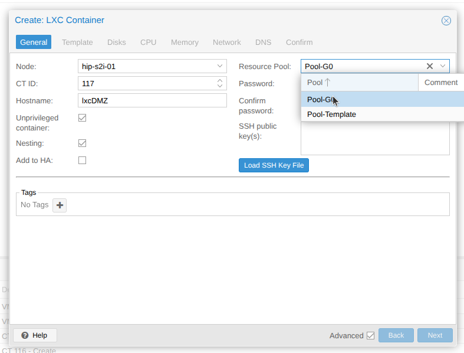
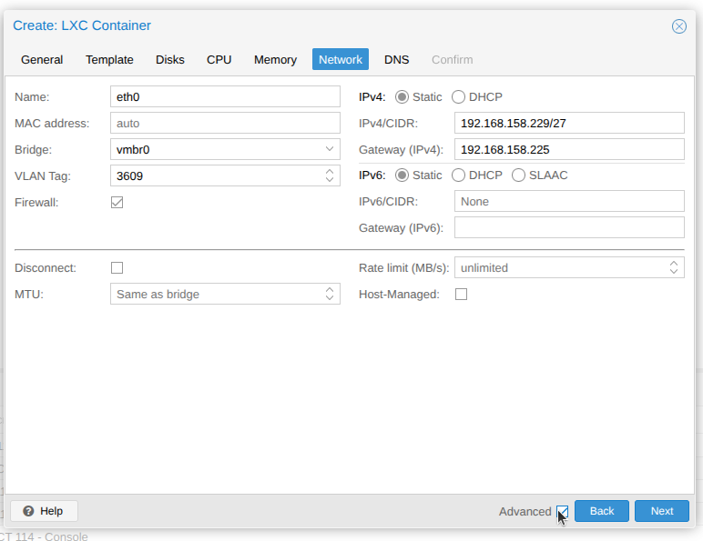
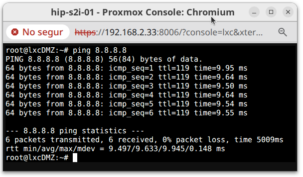

# Documentació MV a la DMZ del grup 0

## Introducció 
S’ha creat un contenidor LXC que ens permetra comprovar que la configuració dels Switch mikrotik.

El contenidor LXC es crearà a partir de la plantilla ubuntu 26.04. I s'ha d'afegir a la configuració de xarxa DMZ, adreces IPs i VLANs

## Creació contenidor lxcDMZ
Al proxmox crear un contenidor pitjar `Create CT`.
* Assignar el nom corresponent i assignar el pool (IMPORTANT!!!)
 
  

* Configurar la VLAN de la DMZ i la configuració de xarxa correctament
  
  

* Comprovar el funcionament
  
  

