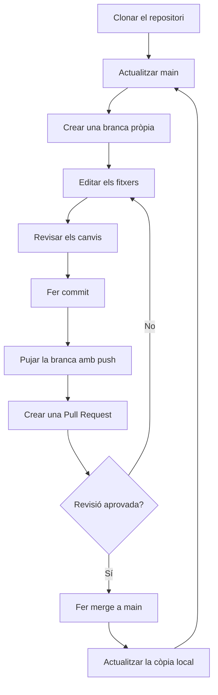

# Projecte del mòdul de Serveis de Xarxes i Internet

## Introducció
Durant aquest curs als mòduls de Serveis de xarxa i internet s’ha de fer feina en grups d’alumnes on cada grup d’alumnes definirà la seva infraestructura informàtica corresponent a una empresa. A aquesta infraestructura s’han implementat diferents servidors i serveis tots ells connectats a través d’una topologia de xarxa especifica de cada empresa. Aquesta infraestructura serà accessible des de l'exterior i es trobarà sempre en funcionament.
La idea seria poder disposar d’un sistema altament disponible, redundant, escalable i amb una gestió de recursos i usuaris segurs.

Per què l'administració d'un sistema informàtic sigui efectiva i eficient és molt important tenir un sistema a on realitzar la documentació i guardar les diferents configuracions dels sistemes. 
Per això es disposarà del següent repositori de github. En aquest repositori és a on els alumnes d'IFC31C documentaran i guardaran les diferents configuracions dels serveis.

La documentació es farà utilitzant MarkDown i perquè la documentació sigui llegible s'hauran d'enllaçar els diferents documents.

## Contingut del projecte
En aquest repositori trobarem una carpeta per cada servei en concret:

* [RA1 servei DNS](RA1DNS/README.md)
* [RA2 servei DHCP](RA2DHCP/README.md)
* [RA3 servei web](RA3Web/README.md)
* [RA4 servei FTP](RA4FTP/README.md)
* [RA5 servei de correu electrònic](RA5/README.md)
* [RA6 Servei de missatgeria instantània](RA6MI/README.md)
* [RA7 servei d'àudio](RA7Audio/README.md)
* [RA8 servei de vídeo](RA8Video/README.md)

A cada una d'aquestes carpetes trobarem un README.md a on es farà una petita descripció del servei com està implementat a l’empresa.

Es suposa que cada un dels serveis s'implementarà amb una serie de servidors, a on generalment per cada servidor trobarem una carpeta generalment amb un README.md a on s'explicarà com s'ha implementat el servei. A mes a més a la mateixa carpeta és podran guardar els fitxers de configuració que siguin clau. La plantilla recomanada per descriure la implantació dels servidors pots ser: 

[Plantilla Documentació](PlantillaDocumentacio.md)

## Guia col·laboració del git

[Guia de col·laboració del git](GUIA-COL·LABORACIO-GIT.md)

### Flux de treball gràfic



### Resum del flux de treball

1. Actualitzeu la branca `main` abans de començar:
	```bash
	git switch main
	git pull --ff-only origin main
	```
2. Creeu una branca pròpia i descriptiva per a cada tasca:
	```bash
	git switch -c docs/la-meva-tasca
	```
3. Reviseu els canvis, feu un commit petit i pugeu la branca:
	```bash
	git status
	git add fitxer.md
	git commit -m "docs: descriu el canvi"
	git push -u origin docs/la-meva-tasca
	```
4. Creeu una Pull Request cap a `main`, demaneu una revisió i espereu l'aprovació abans del merge.

No feu `push` directament a `main` i no pugeu contrasenyes, claus ni certificats privats. Després del merge, actualitzeu la còpia local amb `git pull --ff-only`.
